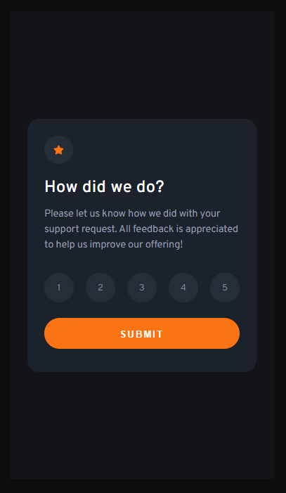
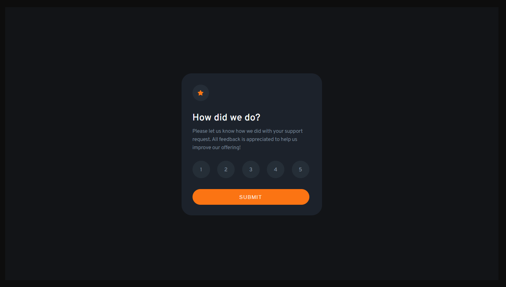

# Frontend Mentor - Interactive rating component solution

This is a solution to the [Interactive rating component challenge on Frontend Mentor](https://www.frontendmentor.io/challenges/interactive-rating-component-koxpeBUmI). Frontend Mentor challenges help you improve your coding skills by building realistic projects.

## Table of contents

- [Overview](#overview)
  - [The challenge](#the-challenge)
  - [Screenshot](#screenshot)
  - [Links](#links)
- [My process](#my-process)
  - [Built with](#built-with)
  - [What I learned](#what-i-learned)
- [Author](#author)

## Overview

### The challenge

Users should be able to:

- View the optimal layout for the app depending on their device's screen size
- See hover states for all interactive elements on the page
- Select and submit a number rating
- See the "Thank you" card state after submitting a rating

### Screenshot

### Links

- Solution URL: [https://github.com/sjohnston82/interactive-rating-component](https://github.com/sjohnston82/interactive-rating-component)
- Live Site URL: [https://golden-beijinho-6dce8d.netlify.app/](https://golden-beijinho-6dce8d.netlify.app/)

## My process

### Built with

- Semantic HTML5 markup
- CSS
- JavaScript

### What I learned

This was one of the easier looking challenges I've come across on FEM, so I decided to just use HTML, vanilla JS and CSS because sometimes I feel like I am too reliant on abstractions like React and NextJs. I also wanted to use URL params to pass the rating state from the main to the thank you page, because in the past in a situation like that I only have used local storage.

## Author

- Website - [Stephen Johnston](https://www.stephenmjohnston.net)
- Frontend Mentor - [@sjohnston82](https://www.frontendmentor.io/profile/sjohnston82)
